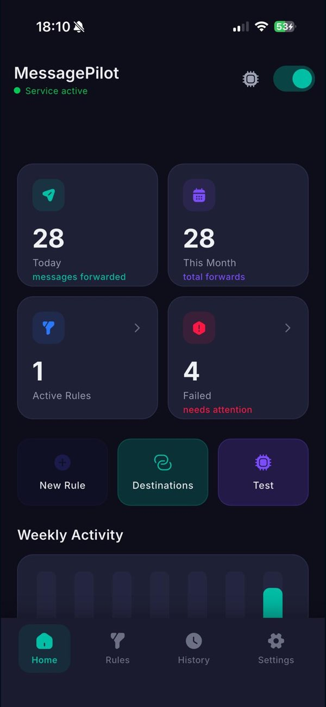
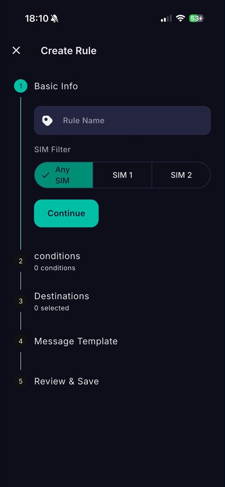
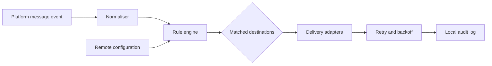

# MessagePilot - SMS Forwarder | App Store Product Showcase

MessagePilot automatically forwards SMS messages received on an iPhone to destinations such as Telegram or email according to user-defined rules. This public repository demonstrates the supporting mobile architecture through routing rules, local audit logs and background delivery workers.

**Live product:** [MessagePilot - SMS Forwarder on the Apple App Store](https://apps.apple.com/us/app/messagepilot-sms-forwarder/id6762195478) - iOS 1.2.0, published by Orcun Ozer.

> **Portfolio snapshot:** this repository is intentionally incomplete. Production endpoints, credentials, receipt validation, subscription logic, background orchestration and most application source files were deliberately removed. The original product remains private; the material here exists only to demonstrate architecture, UI thinking and representative engineering decisions.

## Real App Store screenshots

These are the actual screenshots used on the public Apple App Store listing, not generated mockups.

  
  
  

The screenshots contain no customer message content, destination addresses, credentials or private account data.

## What the private product demonstrates

- Flutter/Dart mobile application architecture with BLoC-style state management
- Rule-based routing with sender, content and time-window predicates
- Destination adapters for email, chat and webhook-based services
- Android background receivers/services and iOS share/automation integration
- Local history, retry state, delivery status and privacy-aware logging
- Remote configuration, licence/subscription checks and controlled feature access
- Turkish/English localisation and platform-specific setup guidance

## Architecture

## Included code

Only two dependency-free examples are included:

- `showcase/routing_rule.dart` - immutable rule model and pure matching logic
- `showcase/delivery_gateway.dart` - interface boundary with the production transport intentionally omitted

These files are representative, not a drop-in copy of the commercial application.

## Security and privacy

- No API keys, tokens, webhook URLs, domains, phone numbers or personal identifiers
- No backend, billing, licence or store-receipt implementation
- No production bundle identifiers or signing material
- No AI-agent configuration, transcripts or private development notes
- New repository history; no commits were copied from the private source repository

## Technology

Flutter, Dart, Android/Kotlin, iOS/Swift, local persistence, background tasks, REST/JSON and webhook integrations.

## Status

Public portfolio showcase only. Not intended for production use or redistribution.
