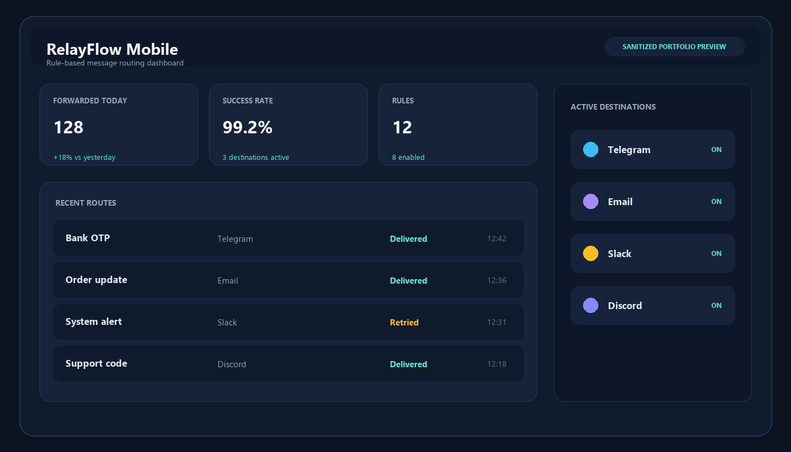
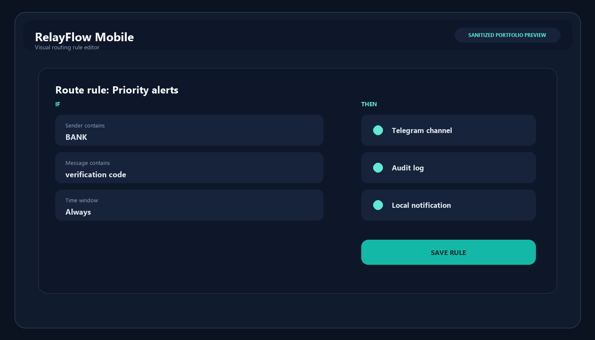
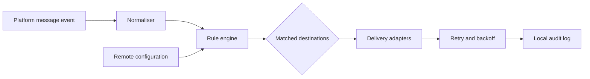

# RelayFlow Mobile - Portfolio Showcase

Cross-platform mobile architecture for routing incoming messages to configurable destinations through rules, local audit logs and background delivery workers.

> **Portfolio snapshot:** this repository is intentionally incomplete. Production endpoints, credentials, receipt validation, subscription logic, background orchestration and most application source files were deliberately removed. The original product remains private; the material here exists only to demonstrate architecture, UI thinking and representative engineering decisions.

## Sanitized UI previews

The previews use fictional data and neutral branding. They do not expose production accounts, destinations or customer messages.

## What the private product demonstrates

- Flutter/Dart mobile application architecture with BLoC-style state management
- Rule-based routing with sender, content and time-window predicates
- Destination adapters for email, chat and webhook-based services
- Android background receivers/services and iOS share/automation integration
- Local history, retry state, delivery status and privacy-aware logging
- Remote configuration, licence/subscription checks and controlled feature access
- Turkish/English localisation and platform-specific setup guidance

## Architecture

## Included code

Only two dependency-free examples are included:

- `showcase/routing_rule.dart` - immutable rule model and pure matching logic
- `showcase/delivery_gateway.dart` - interface boundary with the production transport intentionally omitted

These files are representative, not a drop-in copy of the commercial application.

## Security and privacy

- No API keys, tokens, webhook URLs, domains, phone numbers or personal identifiers
- No backend, billing, licence or store-receipt implementation
- No production bundle identifiers or signing material
- No AI-agent configuration, transcripts or private development notes
- New repository history; no commits were copied from the private source repository

## Technology

Flutter, Dart, Android/Kotlin, iOS/Swift, local persistence, background tasks, REST/JSON and webhook integrations.

## Status

Public portfolio showcase only. Not intended for production use or redistribution.
